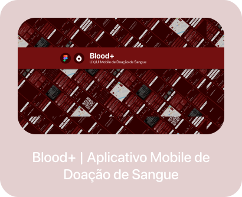

  
  
    

  
    
  
  
  
    

  
   
  
  <picture>
    <source media="(prefers-color-scheme: dark)" srcset="https://raw.githubusercontent.com/Igorcmurai/igorcmurai/output/github-contribution-grid-snake-dark.svg">
    <source media="(prefers-color-scheme: light)" srcset="https://raw.githubusercontent.com/Igorcmurai/igorcmurai/output/github-contribution-grid-snake.svg">
    
  </picture>
  
    

  
    

  
  &nbsp;&nbsp; 

    

  
    
  
   

  
    

  
  &nbsp;&nbsp;&nbsp;&nbsp;
  

    

