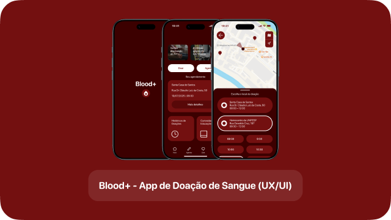
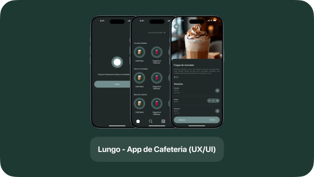
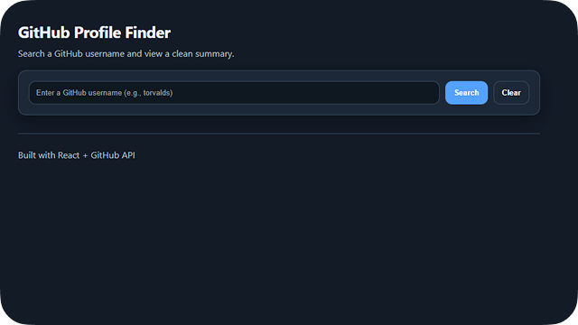

# Igor C. Murai

### UX/UI Designer · Front-end Developer

- **Foco:** UX/UI (Mobile e Web) · Acessibilidade · Usabilidade · Design Systems
- **Ferramentas:** Figma · Framer · HTML · CSS · JavaScript · Git/Github 
- **Diferencial:** interfaces claras, consistentes e centrado ao usuário

 

### Linguagens mais utilizadas

  

 

### Projetos UX/UI

| Projeto | Descrição |
| :---: | :--- |
|  <a href="https://www.behance.net/gallery/231198865/Blood-Aplicativo-Mobile-de-Doacao-de-Sangue" target="_blank"><strong>Blood+</strong></a> | Blood+ - App de Doação de Sangue (UX/UI) |
|  <a href="https://www.behance.net/gallery/225020517/Lungo-Aplicativo-Mobile-de-Cafeteria" target="_blank"><strong>Lungo</strong></a> | Lungo - App de Cafeteria (UX/UI) |

 

### Projetos Front-end

| Projeto | Descrição |
| :---: | :--- |
|  <a href="https://github.com/Igorcmurai/github-profile-finder" target="_blank"><strong>GitHub Profile Finder</strong></a> | Website localizador de perfis do GitHub |

 

### Onde me encontrar

